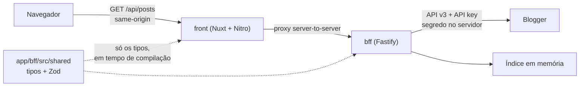

# Arquitetura do Mochi Blog

Este documento existe para responder "por que assim?" daqui a seis meses, quando
ninguém mais lembrar. Cada seção é uma decisão com o problema que ela resolve, o
que ela custa, e quando ela deixa de valer.

---

## 1. Por que separar em BFF e front

### O problema

A API do Blogger aceita chamadas do navegador com uma API key. Daria para montar
uma SPA e consumir direto. Mas isso traz três problemas.

**A chave fica pública.** Ela viaja na URL (`?key=...`) e aparece no DevTools de
qualquer visitante. Restringir por referrer reduz o abuso casual, mas não faz da
chave um segredo.

**SEO.** O Google não espera o JavaScript montar a página. Uma SPA entrega um
HTML praticamente vazio em toda página de post. Para um blog, ser encontrado é o
requisito principal, não um refinamento.

**Formato e política de cache.** A resposta crua do Blogger é verbosa, tem HTML
não sanitizado e não tem campos que a interface precisa (resumo, contagem por
categoria). Consertar isso em cada cliente significa consertar várias vezes.

### A solução



O BFF é o único que conhece o Blogger. O front é o único que conhece o leitor.

### O que isso custa

Um serviço a mais para subir, monitorar e pagar. Em compensação, cada peça pode
mudar sem tocar na outra: trocar o Blogger por outro CMS mexe só no BFF; trocar
Nuxt por outra coisa mexe só no front. O contrato em `app/bff/src/shared` continua
o mesmo.

---

## 2. Por que o CORS "desaparece"

Vale ser preciso, porque a intuição inicial (a sua) era razoável.

| Porta de entrada | CORS do navegador |
|---|---|
| Blogger API v3 (`googleapis.com/blogger/v3`) com `?key=` | **Funciona.** A infra do Google manda os headers. |
| Feed Atom/JSON (`/feeds/posts/default?alt=json`) | **Não funciona.** Não manda header nenhum. |

Ou seja: CORS não era o obstáculo real. Mesmo assim, escolhemos não chamar o
Google do navegador — pelo motivo da chave, não pelo CORS.

Com o BFF separado, surge um CORS novo: `front.vercel.app` chamando
`bff.vercel.app`. Resolvemos sem configurar CORS, usando um **proxy**:

```ts
// app/front/nuxt.config.ts
routeRules: {
  '/api/**': { proxy: `${bffUrl}/api/**` },
}
```

O navegador pede `/api/posts` no domínio do site. O Nitro recebe e repassa. Para
o navegador, é same-origin: sem preflight, sem lista de origens permitidas, e a
URL do BFF não aparece no HTML.

O BFF tem CORS implementado, mas ele fica **desligado** enquanto `CORS_ORIGINS`
estiver vazio. Um BFF que aceita qualquer origem é um BFF que qualquer site pode
usar como intermediário. Só preencha se um cliente externo realmente precisar.

---

## 3. Por que um índice em memória (a decisão central)

### O problema

A API v3 do Blogger é de leitura, remota e paginada por **cursor opaco**
(`nextPageToken`). Não existe "me dê a página 3".

Se cada visita virasse uma chamada, teríamos:

- latência do Google somada à nossa em toda página;
- quota da API consumida por leitores, não por conteúdo novo;
- URLs `/pagina/3` impossíveis, o que é ruim para SEO e para compartilhar link;
- nenhuma busca, porque a v3 não tem endpoint de busca por relevância;
- nenhuma lista de categorias, porque a v3 **não tem endpoint de rótulos** (a v2
  tinha). Na v3, rótulo só existe dentro de cada post.

### A solução

Um blog é um conjunto pequeno de conteúdo que muda pouco: algumas centenas de
posts, atualizados de vez em quando. Isso cabe em memória.

Então o BFF varre o blog inteiro, de 15 em 15 minutos, e serve tudo da memória.
Uma varredura custa poucas requisições e paga por milhares de visitas.

| O que resolvemos de graça | Por quê |
|---|---|
| Paginação por número | Fatiamos um array em memória |
| Busca textual | Filtramos em memória, sem quota |
| Categorias com contagem | Agregamos `labels` de todos os posts |
| Zero chamadas remotas por visita | Só na varredura agendada |
| Resumo dos posts | Derivamos do HTML uma vez, não a cada listagem |

### O comportamento em detalhe

**Stale-while-revalidate.** Se o índice existe mas venceu, respondemos com ele
na hora e atualizamos em segundo plano. Nenhum visitante espera por atualização.
Só a primeira requisição de uma instância nova espera, porque aí não há nada
para servir.

**Uma varredura por vez.** Se dez requisições chegam com o cache frio, elas
compartilham a mesma Promise. Isso evita o *cache stampede*: dez chamadas iguais
ao Google para buscar o mesmo dado.

**Espera entre tentativas que falharam (`RETRY_COOLDOWN_MS`).** Se o Blogger
estiver fora do ar, sem essa trava cada visita ao site dispararia uma nova
tentativa. O problema do vizinho viraria um ataque nosso contra ele, e a quota
derreteria justo quando a API já está mal. Com 30 segundos de espera, a primeira
falha liga um cronômetro e as requisições seguintes respondem na hora.
Verificado na prática: a primeira chamada levou 1,4 s, as seguintes 0,4 ms.

**Post inválido não derruba o blog.** Cada post passa por um `PostSchema.parse`.
Se um vier com formato inesperado, ele é ignorado e registrado no log, em vez de
derrubar o índice inteiro.

**Índice quente entre invocações.** Em serverless, a instância de Fastify vive
fora do handler (`app/bff/api/[...path].ts`). Enquanto o contêiner estiver
quente, o índice sobrevive. Se estivesse dentro do handler, cada requisição
varreria o blog de novo e a quota acabaria em minutos.

### Quando isso deixa de valer

A partir de algumas dezenas de milhares de posts, memória e tempo de varredura
passam a incomodar. O caminho, quando chegar lá, é trocar a memória por um
armazenamento externo (Vercel KV, Redis) mantendo a mesma interface. Aí só
`PostIndex` muda; as rotas não.

---

## 4. Por que sanitizar no BFF

O Blogger devolve o post como HTML cru, escrito por quem escreveu o post. Mesmo
num blog de confiança, esse HTML pode conter um embed de terceiro, um widget do
template ou algo copiado de outro site.

Sanitizar **uma vez, no servidor** é mais seguro e mais barato do que tentar
limpar em cada cliente. O navegador nunca vê HTML cru do Blogger.

O que `sanitize-html` faz aqui:

- **Lista de permissão de tags.** Fora dela, a tag sai e o texto fica.
- **Lista de permissão de atributos.** `style` fica de fora: CSS inline escaparia
  do layout (`position: fixed`, elemento cobrindo a página). Também derruba
  `onerror`, `onclick` e companhia, porque atributo que não está na lista some.
- **Iframe só de domínio conhecido** (`allowedIframeHostnames`). Sem isso, um
  embed vira XSS. YouTube, Vimeo e Spotify estão liberados.
- **Script e style removidos com o conteúdo de dentro** (`nonTextTags`), não só
  a tag.

E duas correções que não são de segurança, mas de produto:

- **Links internos do Blogger viram links do site.** Sem isso, quem clica em
  "veja também" sai do site sem perceber e vai parar no `blogspot.com`.
- **Imagens são pedidas no tamanho que exibimos.** O Blogger serve qualquer
  tamanho a partir da mesma URL (`/s1600/` → `/w800/`). Pedir 1600px para um
  card de 400px é desperdício de banda do leitor. Mesma disciplina do pipeline
  de imagens do projeto `bio`.

Sobre `v-html` no front: é uma escolha consciente e está comentada no arquivo.
Ela só é segura porque todo HTML que sai do BFF passou por aqui.

### Padronização dos rótulos

Os rótulos são padronizados com a primeira letra maiúscula **no BFF**, no momento
em que o post é lido. A tentação natural é fazer isso na interface, e é a
decisão errada por um motivo prático: o nome do rótulo aparece em quatro lugares
(elenco, chips de cada card, título da página de assunto e `<title>`). Cada ponto
de exibição formatando por conta própria significa que basta um esquecimento para
o site mostrar "purple" numa aba e "Purple" no card. Padronizando na entrada,
tudo que vem depois herda a correção, inclusive `/api/labels`, que é agregado a
partir dos posts.

A regra não é "sempre deixar a primeira letra maiúscula". É **"só quando o
rótulo não tem nenhuma maiúscula"**. A regra ingênua estraga nomes que começam
com minúscula de propósito: `iPhone` viraria `IPhone`. Com a condição, `purple`
vira `Purple` e `iPhone` fica intacto. A função está em
`app/bff/src/lib/text.ts`, com a tabela de casos documentada.

Uma consequência honesta: o **Blogger continua mostrando o rótulo como foi
escrito**. Se o blog estiver público, a página de rótulo de lá continua com
"purple" enquanto aqui aparece "Purple". A padronização daqui conserta o passado
e o futuro de uma vez; editar no Blogger consertaria só o que já existe e não
impediria o próximo rótulo em minúsculas. As duas coisas juntas são o ideal.

---

## 5. Erros: o status do vizinho não é o nosso

Um detalhe que parece pequeno e não é. Quando o Blogger responde `400` porque a
chave de API está errada, o BFF responde **502**.

Motivo: um `400` para o navegador significa "a sua requisição está errada". Mas
quem errou fomos nós, na configuração. Repassar o status original faria quem
estiver depurando procurar o problema no lugar errado.

O status do Google vai para o log, onde é útil. O cliente recebe sempre a mesma
forma:

```json
{ "error": { "code": "UPSTREAM_ERROR", "message": "..." } }
```

E o front faz a distinção que importa:

- BFF respondeu **404** → o post não existe → `404` de verdade. O Google
  desindexa, corretamente.
- BFF **não respondeu** → `502`. Um erro temporário não pode fazer o Google
  desindexar posts que estão no ar.

**`statusMessage` não é lugar para texto em português.** Ele vai para a linha de
status do HTTP, que por especificação só aceita ASCII, então um "não" acentuado
seria descartado ou corrompido. O h3 avisa sobre isso no log, e o aviso é fácil
de ignorar. A divisão correta:

- `statusMessage`: curto e em inglês, seguindo a convenção do protocolo
  (`Not Found`, `Bad Gateway`).
- `message`: o texto em português, escrito para o leitor. É o que a página de
  erro exibe.

Detalhe de depuração que confunde: o Nuxt decide entre HTML e JSON pelo cabeçalho
`Accept`. Um `curl` sem `-H "Accept: text/html"` recebe o erro em JSON, com
`statusCode` e `message` no corpo. Isso não significa que a página de erro está
quebrada: quem pede HTML, recebe HTML.

---

## 6. O contrato compartilhado

`app/bff/src/shared` define os schemas com Zod, e o tipo TypeScript é **inferido**
do schema (`z.infer`). Uma declaração produz validação em execução e tipagem em
compilação; é impossível as duas divergirem.

- O **BFF** usa o schema para validar o que vem do Blogger.
- O **front** importa só o **tipo**, com `import type`. Isso é apagado na
  compilação, então nem o Zod nem os schemas entram no bundle do navegador.

Se o BFF mudar o formato de resposta, o `nuxt build` quebra na hora. É um teste
de contrato que você não precisa escrever.

O pacote exporta TypeScript direto, sem etapa de build. É o padrão de "pacote
interno" em monorepo: menos uma etapa para esquecer de rodar.

**Isto já cobrou o seu preço, e vale saber como.** No primeiro deploy, o Vercel
recusou a função com `Cannot find module '.../@mochiblog/shared/src/index.ts'`.
Foram duas causas somadas:

1. O Vercel empacota a função a partir dos arquivos que consegue alcançar dentro
   da Root Directory do projeto (`app/bff`). O pacote morava em `packages/shared`,
   fora dela, então o arquivo não entrava no pacote.
2. Mesmo se tivesse entrado, é `.ts`, e o Node não carrega `.ts`.

O sintoma não ajudava: 500 em toda rota, inclusive numa que não existe, com corpo
vazio. A explicação só aparecia no log da função.

A primeira tentativa foi empacotar o adaptador do Vercel com esbuild, inlinando o
pacote compartilhado. Funcionava, mas era uma etapa de build a mais para contornar
um problema que a própria estrutura criava.

A solução final foi aceitar a regra do Vercel em vez de lutar contra ela: **o
código compartilhado mudou para `app/bff/src/shared/`**, dentro da Root Directory.
Cada consumidor o alcança por um caminho diferente:

- O **BFF** importa `./shared/index.js` — está dentro do próprio pacote, então o
  Vercel leva junto sem nenhum esforço.
- O **front** importa o caminho relativo `../../bff/src/shared/index.js` com
  `import type`. Como é só tipo, o import é apagado na compilação: o front não
  depende desse arquivo existir no servidor dele.

O BFF também deixou de ter etapa de build. O script `build` é só
`tsc --noEmit`, que confere os tipos e não gera nada; quem compila a função para
produção é o Vercel, a partir dos `.ts` que estão dentro de `app/bff`.

**Verificado:** o adaptador `app/bff/api/[...path].ts` importa `../src/app.js`
enquanto o arquivo é `app.ts`, e isso **resolve igual no Vercel**. A prova veio do
próprio erro de boot: a função chegava a carregar as rotas e só morria lá dentro,
ao importar uma dependência. Se a resolução do `.js` falhasse, o erro seria outro,
mais cedo.

**E o Vercel não roda o Node que você tem na máquina.** A segunda rodada de erro
foi:

```
require() of ES Module .../htmlparser2@12.0.0/.../dist/index.js not supported
```

O `sanitize-html` é CommonJS e faz `require()` do `htmlparser2` por dentro. A
partir da versão **2.17.2** ele passou a depender do `htmlparser2` 10+, que é ESM
puro (`"type": "module"`). Carregar ESM de dentro de CommonJS por `require()` só é
possível a partir do **Node 22.12**, e o ambiente do Vercel estava abaixo disso.

Declarar `"engines": { "node": ">=22.12" }` **não resolveu** — o Vercel ignorou a
exigência. A lição foi parar de depender da versão de Node de outra pessoa: o
`sanitize-html` ficou cravado em **2.17.1**, a última que usa o `htmlparser2` 8
(CommonJS) e portanto funciona em qualquer Node.

Repare no detalhe que quase passou: `2.17.0` e `2.17.1` usam `htmlparser2 ^8`, e do
`2.17.2` em diante já é ESM. Um `~2.17.0` não bastaria — só a versão exata serve.
A regra que ficou: uma dependência que exige Node recente é uma dependência que
você não controla. Prefira a versão que funciona em qualquer lugar.

### A armadilha do nome `[...path].ts`

Havia no código uma suposição escrita com todas as letras: a de que
`api/[...path].ts` seria um pega-tudo, e que qualquer caminho abaixo de `/api`
cairia ali. Não é.

Medido em produção, com quatro requisições:

| Caminho | Segmentos | Resultado |
|---|---|---|
| `/api/health` | 1 | chega na função |
| `/api/posts` | 1 | chega na função |
| `/api/posts/test-4` | 2 | 404 do Vercel, sem executar nada nosso |
| `/api/auth/login` | 2 | 404 do Vercel, sem executar nada nosso |

Fora do Next.js, nessa pasta de funções, o Vercel gera uma rota casando **um**
segmento. O `[...path]` do nome do arquivo não muda isso.

O disfarce é a pior parte do sintoma: metade da API funcionava — as rotas de um
segmento, que por coincidência são home, rótulos e busca — e a outra metade
devolvia a página de erro do Vercel. O login caía no lado quebrado, então o
painel ficou inalcançável em produção enquanto o servidor local respondia tudo
certo, porque lá quem roteia é o Fastify e não o Vercel.

A correção tem duas partes. A primeira é uma reescrita em
`app/bff/vercel.json`:

```json
{ "source": "/api/(.*)", "destination": "/api/[...path]?rest=$1" }
```

A segunda é a função remontar a URL antes de entregar ao Fastify, em
`app/bff/src/lib/request-url.ts`. Ela aceita as duas formas possíveis de
propósito: com a URL original preservada, ou com o caminho real vindo no
parâmetro `rest`. Qual das duas acontece é detalhe interno do Vercel que ninguém
prometeu, e aceitar ambas custa menos do que uma rodada de deploy para descobrir.

**A lição que fica.** Comportamento que ninguém mediu não é comportamento
conhecido — é suposição, mesmo quando está escrita num comentário do código.
Aquele comentário afirmava o pega-tudo com convicção. Comentário não é prova, e
foi o que manteve o bug vivo depois de um deploy que parecia ter dado certo.

---

## 7. SEO: a estratégia e o que falta

O que já está feito:

- HTML renderizado no servidor, com título, descrição e `og:*` por página.
- `<link rel="canonical">` apontando para este site.
- JSON-LD (`BlogPosting`) no post, para resultado rico na busca.
- A página de busca leva `robots: noindex, follow`, para não competir com as
  páginas de conteúdo em resultados de busca.
- Falha de infraestrutura devolve 502, nunca 404.

**E o canonical do outro lado.** O mesmo texto também existe no Blogger, então os
buscadores veem conteúdo duplicado e nós declaramos qual é a versão oficial. Para
isso funcionar de verdade, o tema do Blogger precisa declarar o **mesmo**
canonical apontando para cá. Enquanto isso não for feito, o Blogger continua se
declarando a versão original e a duplicação permanece.

---

## 8. Navegação por assunto (o elenco)

A navegação por assunto é feita pelas **pílulas das quatro personagens**, cada uma
apontando para `/tag/<rótulo>`. Não existe mais barra de abas no topo.

### O que mudou, e por quê

A versão anterior montava a barra de abas a partir de `/api/labels`, e a decisão
estava escrita aqui com estas palavras: *"as abas vêm da API, nunca fixas no
código"*. O objetivo era que um rótulo novo criado no Blogger nunca deixasse
post invisível.

Isso foi **revertido de propósito**, e o motivo é o desenho: cada pílula tem cor e
desenho próprios, e não existe gradiente para inventar a partir de um rótulo
desconhecido. O elenco é curado, com quatro nomes, e a reversão fica registrada
para quem mexer depois não achar que foi descuido.

O que se perde: um rótulo que não seja de nenhuma das quatro personagens não tem
pílula. O que continua valendo: o post **não desaparece** — ele aparece na home,
que lista todos, e na busca. A avaliação do dono do projeto foi que o conteúdo é
sempre marcado com um dos quatro nomes, e que manter uma linha extra de rótulos
não se paga.

### Onde as pílulas aparecem

| Onde | Forma | Papel |
|---|---|---|
| Capa da home | Grandes, com o desenho | Convite: entrar e ver os posts |
| Barra que acompanha a rolagem | Só o nome, com o gradiente | Filtro: trocar de assunto lendo |
| Página de assunto | Só o nome, com o gradiente | Filtro: trocar de assunto sem voltar |

As três usam a mesma pílula (`GradientPill`) e a mesma lógica de qual está acesa
(`useCast`), então não têm como discordar entre si.

### Decisões que continuam valendo

**Cada assunto é um endereço próprio, não estado interno.** A alternativa seria
trocar o conteúdo sem sair da home, deixando tudo em `/?aba=Mochi`. É mais rápido
de sentir e pior em dois aspectos: ninguém consegue compartilhar "os posts da
Ruka", e o buscador enxerga uma página só.

**A pílula acesa é derivada da rota, não de estado local.** Não há nada para
sincronizar: recarregar, usar o botão voltar ou abrir o link direto mantêm a
pílula certa acesa. A comparação ignora caixa e acento, então `/tag/RUKA` e
`/tag/ruka` acendem a mesma pílula, do mesmo jeito que o BFF trata o filtro.

### A capa, e a barra que acompanha a rolagem

A home abre com uma tela inteira só de desenhos, em diagonal ascendente — as
quatro personagens são voadoras, e uma fileira reta não diria isso. Cada uma é uma
âncora para a lista de posts, e o nome fica embaixo do desenho, sempre visível.
Esconder o nome de quem está escolhendo é esconder a informação de que ele
precisa, e no celular não existe ponteiro para passar por cima.

A barra de filtros fica logo depois da capa e é `sticky`. A presença dela segue a
rolagem: invisível com a capa inteira na tela, aparecendo conforme ela sobe, e
sumindo de volta ao subir. Quem faz a conta é o `useScrollProgress`, que devolve a
proporção da capa que já passou; a barra recebe o número e só desenha.

Enquanto está invisível, a barra é `inert`, e não apenas transparente. A
diferença importa: `pointer-events: none` sozinho deixaria os links alcançáveis
pelo teclado — invisíveis e alcançáveis é a pior combinação possível.

### Consequências aceitas

- **A capa não cabe no container de leitura.** Ela usa a largura toda, e por isso
  o layout deixou de embrulhar as páginas: cada página decide a própria largura, e
  quem quer a caixa estreita usa `class="container"`.
- **Post sem rótulo** aparece só na home e na busca.
- **Dentro de um post**, nenhuma pílula fica acesa, porque elas só conhecem a
  rota. Está registrado nas pendências.

---

## 9. Autenticação: duas camadas, não uma

A confusão natural é achar que existe "um login". Não existe: são duas
autorizações independentes, com donos diferentes.

**O login do site** diz QUEM entra no painel. É nosso: e-mail e senha guardados
no servidor, cookie de sessão. A autora nunca vê o Google.

**A permissão de escrita** diz se o serviço pode gravar no Blogger. É do Google,
exige OAuth 2.0 (a API key só lê) e é obtida uma única vez, na instalação.

Separar as duas tem uma consequência boa: o token do Google nunca precisa ir para
o navegador. Ele fica parado na variável de ambiente, e o cookie de sessão carrega
apenas identidade. Se a sessão for roubada, o atacante ganha o painel enquanto o
cookie valer — não uma credencial permanente do Google.

### O que garante que ninguém sem autorização escreve

| Camada | O que impede |
|---|---|
| Google | Só a conta dona do blog consegue gravar, mesmo com sessão válida nossa. |
| Sessão no servidor | Toda rota de escrita tem `preHandler`. Sem sessão: 401, e o handler não roda. |
| Origem conferida | Escrita vinda de outro site responde 403. |
| Cookie `HttpOnly` | JavaScript não lê a sessão, então um XSS não a rouba. |
| AES-GCM no cookie | Cookie adulterado não abre: a tag de autenticação não confere. |
| Limite de tentativas | Cinco tentativas de login por minuto. Sem isso, senha curta cai por força bruta. |
| scrypt na senha | Cada tentativa custa cerca de 30 ms de CPU nossa, o que encarece o ataque. |
| Rotas condicionais | Sem autenticação configurada, as rotas de escrita nem são registradas. |

O ponto que responde à preocupação original: **esconder o botão na interface não
protege nada.** O que protege é o servidor recusar toda escrita sem sessão válida,
venha a requisição de onde vier. A interface só decide o que mostrar.

### Por que cookie e não localStorage

O cookie é `HttpOnly`, então nenhum JavaScript da página consegue lê-lo. Como este
site renderiza HTML do Blogger com `v-html`, essa diferença importa: um HTML que
escapasse do sanitizador roubaria uma sessão guardada em localStorage, e não rouba
um cookie `HttpOnly`.

### A consequência do `Path=/api`

O cookie de sessão só viaja em chamadas à API, o que é uma economia real: ele não
aparece em navegação entre páginas nem em pedido de imagem. A consequência é que
o navegador **não o envia ao pedir a página `/admin`**, e então o servidor não tem
como saber se há sessão ao renderizar o painel.

Medido, não suposto: com cookie válido, o HTML que o servidor devolvia para
`/admin` vinha com o formulário de login. A pessoa veria "Entrar" por um instante
e depois o painel — o tipo de coisa que parece bug.

A saída foi renderizar a rota `/admin` só no navegador, e não ampliar o `path` do
cookie para `/`. Como o painel é uma ferramenta privada e já nasce fora do índice
dos buscadores, a renderização no servidor não trazia ganho nenhum; e o cookie
continua trafegando o mínimo. Se um dia o painel precisar de SSR, a decisão está
registrada no próprio `session.ts`.

### O que ficou deliberadamente de fora

**Não há upload de imagem**, porque a API não oferece. As rotas de escrita
devolvem um link para o editor do Blogger, que é onde a foto entra.

**Não há banco de sessões.** O cookie carrega a sessão inteira, cifrada, o que
funciona em serverless: um `Map` de sessões se perderia a cada instância nova e
deslogaria a autora sem motivo. A troca é não conseguir revogar uma sessão
específica. Com uma única pessoa escrevendo, sair resolve. Se houver mais de uma
autora um dia, o lugar certo passa a ser um armazenamento externo, e só o módulo
de sessão muda.

**O conteúdo não é sanitizado na escrita**, só na leitura. Sanitizar antes de
gravar alteraria o que fica guardado no Blogger (os links internos são
reescritos) e tiraria da autora recursos que o editor de lá permite. O que fica
gravado é o que ela escreveu; o que o site exibe é o que passou pelo filtro.

---

## 10. Pendências

Em ordem de valor.

### Alta

- [ ] **Identidade visual real.** As cores e fontes atuais são um palpite
      ("mochi" puxou para rosa e massa de arroz). Trocar é mexer nos tokens de
      `assets/css/main.css`, um lugar só.
- [ ] **Canonical do lado do Blogger**, editando o tema de lá.
- [ ] **Sitemap e RSS.** O Sitemap dá ao Google a lista de posts e ajuda a
      indexar mais rápido; o RSS é o que os leitores assinam.
- [ ] **Imagem de Open Graph por post.** Hoje o compartilhamento no WhatsApp e
      no Twitter sai sem imagem ou com a capa crua.

### Média

- [ ] **Página "Sobre".** Um blog pessoal ganha muito com uma cara e uma história.
- [ ] **Paginação na busca.** A API já aceita `page`; falta o controle na tela.
- [ ] **Cache de borda explícito** no Vercel, além dos headers já enviados.
- [ ] **Slug antigo → slug novo.** Se o título de um post mudar no Blogger, o
      slug muda e o link antigo dá 404. Um mapa de redirecionamentos resolve.

### Baixa

- [ ] **Nome canônico do rótulo no `<h1>` da página de assunto.** Hoje o título
      mostra o rótulo como veio na URL, então `/tag/RUKA` exibe "RUKA" enquanto a
      pílula acesa diz "Ruka". Todas as ligações internas usam a grafia original,
      então isso só aparece em endereço digitado à mão. A correção é usar o elenco
      (`data/cast.ts`) para achar o nome canônico, caindo para a URL quando o
      rótulo não for de ninguém do elenco.
- [ ] **Pílula acesa dentro de um post.** Hoje, em `/post/<slug>`, nenhuma pílula
      fica destacada, porque elas derivam o estado apenas da rota. Dá para acender
      a pílula da personagem dona do post, mas exigiria estado compartilhado entre
      a página e a barra, com risco de ficar desatualizado. Não vale a troca
      enquanto a barra sem destaque não incomodar.

- [ ] **Testes.** O `buildApp()` já está separado do `listen()` exatamente para
      permitir `app.inject()`. O primeiro bom teste seria do `PostIndex` com um
      cliente do Blogger falso.
- [ ] **Tema claro/escuro manual.** Hoje segue o sistema operacional.
- [ ] **Comentários.** A API do Blogger tem `comments.list`; exigiria OAuth para
      escrever.

---

## 11. Decisões descartadas (e por quê)

**Chamar o Blogger direto do navegador.** Funcionaria, porque a API v3 manda
headers de CORS. Descartado pela chave exposta e pelo SEO.

**Vite + Vue SPA pura.** Você já conhece, seria mais rápido de escrever, e o
Google veria páginas vazias. Para um blog, é o requisito principal sendo
sacrificado.

**Vite + Vue com prerender no build (SSG).** Bom SEO, zero servidor. Descartado
porque um post novo só apareceria após um rebuild. Você disse que a autora posta
com frequência e quer ver na hora. Um blog cujo conteúdo não aparece é uma
reclamação garantida.

**Usar o feed `/feeds/posts/default?alt=json`.** Não manda CORS, o formato é
feio e a paginação é pior que a da API v3.

**NestJS no BFF.** Bom para portfólio, canhão para um serviço que faz três
coisas. Fastify entrega a mesma qualidade com menos cerimônia.

**Guardar o `pageToken` do Blogger e expor cursor na nossa API.** Honesto em
relação ao upstream, mas produz URLs que ninguém compartilha e que o Google
indexa pior. O índice em memória resolveu o problema na raiz.
